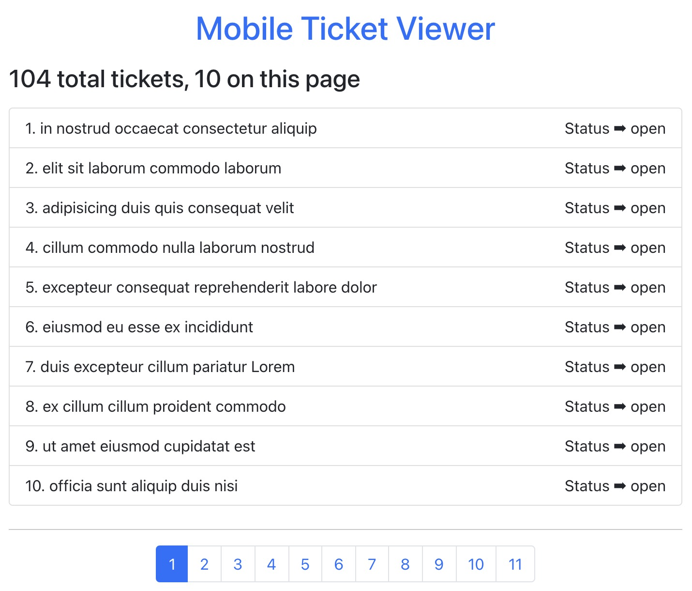

# **Zendesk Coding Challenge**

A mobile tickets viewer web application of Zendesk's accounts.

#### Preview:

___

## **Steps**

### **Install**

Clone the project to a local directory named "zendesk":
    
    git clone https://github.com/Tingting-Jiang/zendesk-coding-challenge.git

**Prerequisite:**

Open two terminal windows: both get into the local directory "zendesk"

    cd zendesk

Install node_modules dependencies:

Terminal NO.1 (in server)

    cd server
    npm install

Terminal NO.2  (in zendesk)

    npm install

___

### **Build**

##### Terminal NO.1 (in server)

Create a new file called "server-data.js" under "server" directory and copy the following code into it.

    const base = require('base-64');
    
    const USER = "jtting@126.com";
    
    const PASS = "Jtting@126.com";
    
    let AUTH = "Basic " + base.encode(USER + ":" + PASS);
    
    module.exports = AUTH;
---
Then run the following code in Terminal NO.1

    cd server

    npm start

##### Terminal NO.2  (in zendesk-coding)

    npm start

##### Run test

First exit (Ctrl + C / D ) from both terminals, use Terminal NO.2 to run the following

    npm test

### **Test Coverage Result**
File               | % Stmts | % Branch | % Funcs | % Lines | Uncovered Line #s 
-------------------|---------|----------|---------|---------|-------------------
All files          |     100 |      100 |     100 |     100 |                   
 src               |     100 |      100 |     100 |     100 |                   
  App.js           |     100 |      100 |     100 |     100 |                   
 src/components    |     100 |      100 |     100 |     100 |                   
  Pagination.js    |     100 |      100 |     100 |     100 |                   
  TicketDetails.js |     100 |      100 |     100 |     100 |                   
  TicketList.js    |     100 |      100 |     100 |     100 |                   
  TicketSummary.js |     100 |      100 |     100 |     100 |                   
  Tickets.js       |     100 |      100 |     100 |     100 |                   
 src/data          |     100 |      100 |     100 |     100 |                   
  data.js          |     100 |      100 |     100 |     100 |                   

Test Suites: 6 passed, 6 total

Tests:       24 passed, 24 total

Snapshots:   10 passed, 10 total

Time:        2.109 s
